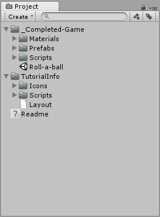
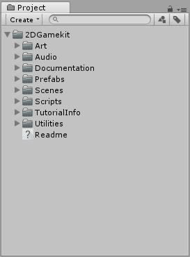
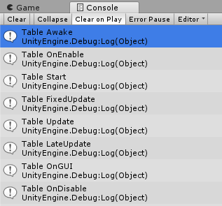
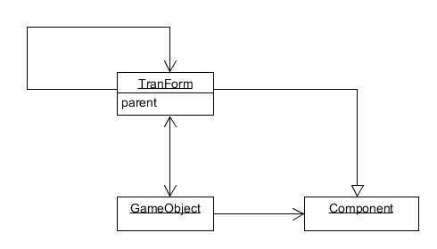
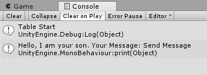

# Homework 1

> Unity3d-Learning      
>
> 离散仿真引擎基础

## 简答题

1.解释 游戏对象（GameObjects） 和 资源（Assets）的区别与联系。

> **游戏对象（GameObjects）**
>
> 游戏对象 (GameObject)是所有其他组件 (Component) 的容器。游戏中的所有对象本质上都是游戏对象。游戏对象包括：空、3D物体（立方体 、 球体 、 胶囊 、 圆柱体 、 平面和四边形 …）、2D物体（精灵/图片）、摄像机、灯光（平面，聚光，…）、音频、UI 元素、粒子系统、……

> **资源（Assets）**
>
> 资源是任何可以在游戏或项目中使用的项目的代表。资源可能来自于Unity之外创建的文件，如三维模型、音频文件、图像或Unity支持的任何其他类型的文件。也有一些可以在Unity中创建的资源类型，如动画师控制器、音频混音器或渲染纹理。

> **两者联系**
>
> 游戏对象可以成为资源从而作为模板使用。而资源可以包含游戏对象、图像、音频、模型、代码等。

2.下载几个游戏案例，分别总结资源、对象组织的结构（指资源的目录组织结构与游戏对象树的层次结构）

> 资源目录的层次结构如图所示，Scripts、Icons、Audio、Scenes等中分别放置代码、图标、音频、场景等。
>
> 

3.编写一个代码，使用 debug 语句来验证 [MonoBehaviour](https://docs.unity3d.com/ScriptReference/MonoBehaviour.html) 基本行为或事件触发的条件

- 基本行为包括 Awake() Start() Update() FixedUpdate() LateUpdate()

- 常用事件包括 OnGUI() OnDisable() OnEnable()

  > **代码**
  >
  > ```c#
  > using System.Collections;
  > using System.Collections.Generic;
  > using UnityEngine;
  >
  >
  > public class script : MonoBehaviour {
  > 	
  > 	//Let the functions be invoked only once
  > 	private bool isUpdate = false; 
  > 	private bool isFixedUpdate = false;
  > 	private bool isLateUpdate = false;
  > 	private bool isOnGUI = false;
  >
  > 	// Use this for initialization
  > 	void Start () {
  > 		Debug.Log ("Table Start");
  > 	}
  > 	
  > 	// Update is called once per frame
  > 	void Update () {
  > 		if (!isUpdate) {
  > 			Debug.Log ("Table Update");
  > 			isUpdate = true;
  > 		}
  > 	}
  >
  > 	private void Awake () {
  > 		Debug.Log ("Table Awake");
  > 	}
  >
  > 	private void FixedUpdate () {
  > 		if (!isFixedUpdate) {
  > 			Debug.Log ("Table FixedUpdate");
  > 			isFixedUpdate = true;
  > 		}
  > 	}
  >
  > 	private void LateUpdate () {
  > 		if (!isLateUpdate) {
  > 			Debug.Log ("Table LateUpdate");
  > 			isLateUpdate = true;
  > 		}
  > 	}
  >
  > 	private void OnGUI () {
  > 		if (!isOnGUI) {
  > 			Debug.Log ("Table OnGUI");
  > 			isOnGUI = true;
  > 		}
  > 	}
  >
  > 	private void OnDisable () {
  > 		Debug.Log ("Table OnDisable");
  > 	}
  >
  > 	private void OnEnable () {
  > 		Debug.Log ("Table OnEnable");
  > 	}
  > }
  > ```

  > **运行结果**
  >
  > 


4.查找脚本手册，了解 [GameObject](https://docs.unity3d.com/ScriptReference/GameObject.html)，Transform，Component 对象

- 分别翻译官方对三个对象的描述（Description）

  > **GameObject**
  >
  > *The **GameObjects** are the fundamental objects in Unity that represent characters, props and scenery. They do not accomplish much in themselves but they act as containers for Components, which implement the real functionality.*
  >
  > 游戏对象是代表人物、道具和场景的基本对象。它们本身没有实现太多功能，但它们充当组件的容器，而组件实现真正的功能。

  >  **Transform** 
  >
  >  *The **Transform** is used to store a GameObject’s position, rotation, scale and parenting state and is thus very important.*
  >
  >  变换是用来存储一个对象的位置、旋转、尺度和父对象的状态的，是非常重要的。

  > **Component**
  >
  > *Base class for everything attached to GameObjects.*
  >
  > 组件是所有附属于游戏对象的基类。

- 描述下图中 table 对象（实体）的属性、table 的 Transform 的属性、 table 的部件
  - 本题目要求是把可视化图形编程界面与 Unity API 对应起来，当你在 Inspector 面板上每一个内容，应该知道对应 API。
  - 例如：table 的对象是 GameObject，第一个选择框是 activeSelf 属性。

  > **table 对象（实体）的属性**
  >
  > - Tag: Untagged
  >
  > - Layer: Default
  >
  > **table 的 Transform 的属性**
  >
  > - Position: (0, 0, 0)
  > - Rotation: (0, 0, 0)
  > - Scale: (1, 1, 1)
  >
  >  **table 的部件**
  >
  > - chair1
  > - chair2
  > - chair3
  > - chair4

- 用 UML 图描述 三者的关系（请使用 UMLet 14.1.1 stand-alone版本出图）

  > 


5.整理相关学习资料，编写简单代码验证以下技术的实现：
- 查找对象

  > ```c#
  > public static GameObject Find(string name);
  > public static GameObject[] FindGameObjectsWithTag(string tag);
  > public static GameObject FindWithTag(string tag);
  > ```

  > ```c#
  > void Start () {
  >     Debug.Log ("Table Start");
  >     GameObject table = GameObject.Find("table");
  >     Debug.Log (table.name);
  > }
  > ```

- 添加子对象

  > ```c#
  > public static GameObject CreatePrimitive(PrimitiveType type);
  > ```

  > ```c#
  > void Start () {
  >     Debug.Log ("Table Start");
  >     GameObject cube = GameObject.CreatePrimitive (PrimitiveType.Cube);
  >     cube.name = "a cube";
  >     cube.transform.position = new Vector3 (0, Random.Range (0, 5), 0);
  >     cube.transform.parent = this.transform;
  > }
  > ```

- 遍历对象树

   > ```c#
   > foreach(Transform child in transform);
   > ```


- 清除所有子对象

  > ```c#
  > foreach(Transform child in transform) {
  >    Destroy(child.gameObject);
  > }
  > ```

6.资源预设（Prefabs）与 对象克隆 (clone)
- 预设（Prefabs）有什么好处？

  > 预设（Prefabs）可以很方便的通过添加组件及其属性的设置为适当的值在场景中建立一个对象。

- 预设与对象克隆 (clone or copy or Instantiate of Unity Object) 关系？

  > 然而，当你有一个像NPC、道具或风景的物体在场景中重复使用几次时，这会产生问题。简单地复制对象肯定会产生重复，但它们都是独立编辑的。一般来说，我们希望某个特定对象的所有实例都具有相同的属性，所以当我们在场景中编辑一个对象时，最好不要重复对所有副本进行相同的编辑。

- 制作 table 预制，写一段代码将 table 预制资源实例化成游戏对象

  > ```c#
  > void Start () {
  >     Debug.Log ("Table Start");
  >     GameObject table = GameObject.CreatePrimitive(PrimitiveType.Cube);
  >     GameObject anotherTable = (GameObject)Instantiate (table.gameObject);
  >     anotherTable.name = "newTable";
  >     anotherTable.transform.position = new Vector3 (0, Random.Range (5, 7), 0);
  >     anotherTable.transform.parent = this.transform;
  > }
  > ```

7.尝试解释组合模式（Composite Pattern / 一种设计模式）。使用 BroadcastMessage() 方法
- 向子对象发送消息

  > **组合模式（Composite Pattern / 一种设计模式）**
  >
  > 组合模式，将对象组合成树形结构以表示“部分-整体”的层次结构，组合模式使得用户对单个对象和组合对象的使用具有一致性。

  > **使用 BroadcastMessage() 方法向子对象发送消息**
  >
  > **父类对象（table）方法**
  >
  > ```c#
  > void Start () {
  >     Debug.Log ("Table Start");
  >     this.BroadcastMessage("Test", "Send Message");
  > }
  > ```
  >
  > **子类对象（chair1）方法**
  >
  > ```c#
  > public void Test(string str) {
  > 	print ("Hello, I am your son. Your Message: " + str);
  > }
  > ```
  >
  > **运行结果**
  >
  > 

