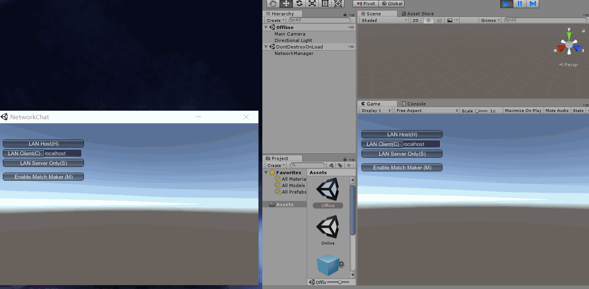
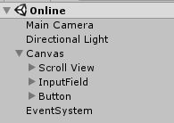
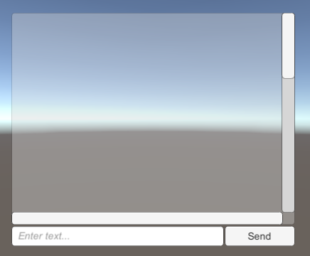
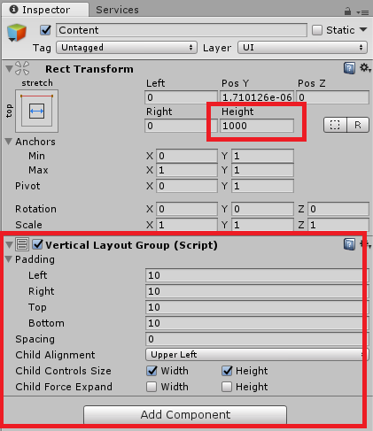
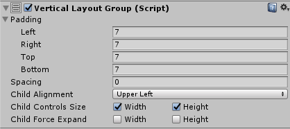
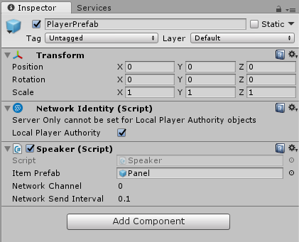
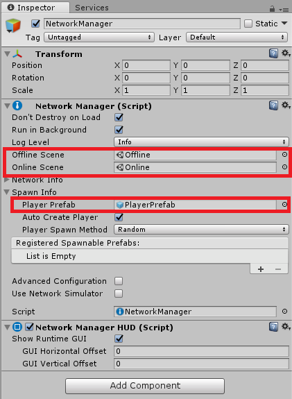

# 简单网络聊天室

> Homework 10
>
> 多人游戏与网络

参考博客：https://blog.csdn.net/final5788/article/details/78163329

## 效果GIF

看这个gif就行了，已经详细录制全过程，不再录视频

## 实现

### 1、创建Offline场景

1. 创建一个空对象，改名为NetworkManager
2. 在NetworkManager里添加组件：NetworkManager、NetworkManagerHUD
3. 保存场景到Assets

###2、创建Online场景

1. 如下图，分别创建Scroll View、InputField、Button，并设定好它们的布局

   

   

   

2. Canvas/Scroll View/ViewPort/Content设置如下（添加VerticalLayoutGroup组件和修改Height）：

   

3. 制作消息框预制

   - 创建一个Panel，添加VerticalLayoutGroup组件，设置如下：

     

   - 在Panel下创建一个Text，用于显示用户发送的文字消息 

   - 保存成Prefab，用于在代码中动态创建消息框，并删除刚才的Panel 

4. 制作玩家预制

   - 创建一个空对象，改名为PlayerPrefab
   - 在PlayerPrefab里添加NetworkIdentify组件，勾选Local Player Authority
   - 新建Speaker.cs脚本，拖进PlayerPrefab
   - 将Assets中的Panel拖进Speaker.cs脚本的Item Prefab
   - 保存成Prefab，并删除刚才的PlayerPrefab

   设置如下图：

   

### 3、设置NetworkManager

如图，将Offline和Online场景、PlayerPrefab拖入：

### 4、运行

选择File -> Build Setting，选择两个场景，然后Build & Run。开两个示例，一个作为服务端，另一个作为客户端。