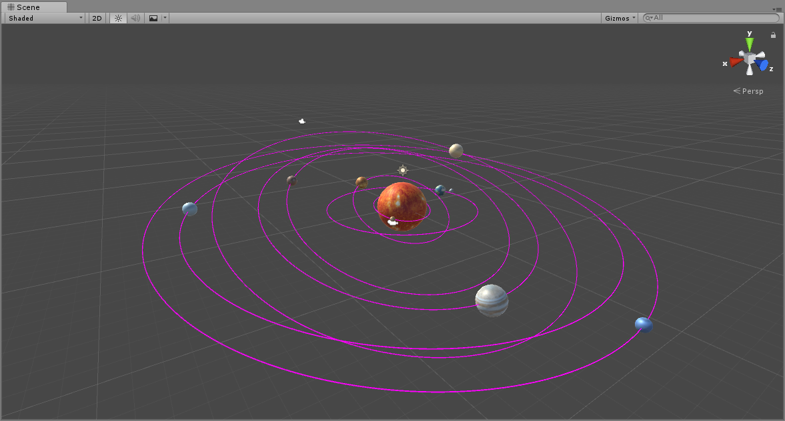
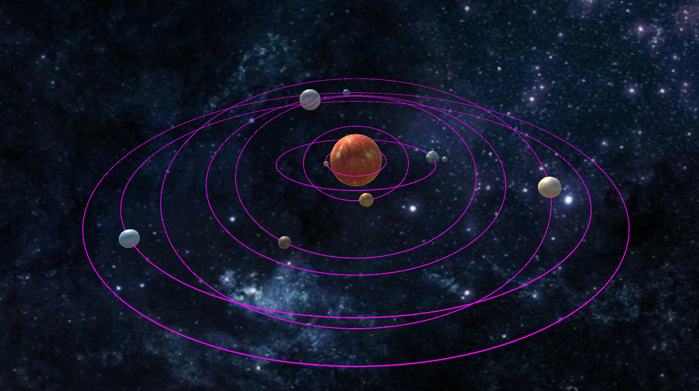
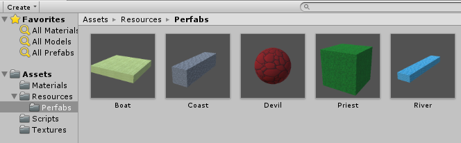

# Homework 2

> Unity3d-Learning      
>
> 空间与运动
>
> [博客](https://blog.csdn.net/MRMRWWW/article/details/79810536)

## 1、简答题

1.游戏对象运动的本质是什么？

> 游戏对象运动的本质，是它随着页面刷新而产生的连续的运动，包括游戏对象的位置、旋转、角度、大小等。

2.请用三种方法以上方法，实现物体的抛物线运动。（如，修改Transform属性，使用向量Vector3的方法…）

> **方法1  修改Transform属性**
>
> ```c#
> using System.Collections;
> using System.Collections.Generic;
> using UnityEngine;
> using System;
>
> public class Parabola : MonoBehaviour {
>
> 	public float initialSpeed = 30f;
> 	private float xSpeed;
> 	private float ySpeed;
> 	private float angle = Mathf.PI / 3;
> 	public float gravity = 30f;
>
> 	// Use this for initialization
> 	void Start () {
> 		xSpeed = initialSpeed * Mathf.Cos(angle);
> 		ySpeed = initialSpeed * Mathf.Sin(angle);
> 	}
> 	
> 	// Update is called once per frame
> 	void Update () {
> 		//根据斜上抛运动公式
> 		Vector3 vec = new Vector3(Time.deltaTime * xSpeed, Time.deltaTime * ySpeed, 0);
> 		this.transform.position += vec;
> 		ySpeed -= gravity * Time.deltaTime;
> 	}
> }
> ```

> **方法2  使用向量Vector3的方法：Vector3.Lerp**
>
> ```c#
> using System.Collections;
> using System.Collections.Generic;
> using UnityEngine;
> using System;
>
> public class Parabola : MonoBehaviour {
>
> 	public float initialSpeed = 30f;
> 	private float xSpeed;
> 	private float ySpeed;
> 	private float angle = Mathf.PI / 3;
> 	public float gravity = 30f;
>
> 	// Use this for initialization
> 	void Start () {
> 		xSpeed = initialSpeed * Mathf.Cos(angle);
> 		ySpeed = initialSpeed * Mathf.Sin(angle);
> 	}
> 	
> 	// Update is called once per frame
> 	void Update () {
> 		//根据斜上抛运动公式
> 		Vector3 vec = new Vector3(Time.deltaTime * xSpeed, Time.deltaTime * ySpeed, 0);
> 		transform.position = Vector3.Lerp (transform.position, transform.position + vec, 1);
> 		ySpeed -= gravity * Time.deltaTime;
> 	}
> }
> ```

> **方法3  使用transform.Translate方法**
>
> ```c#
> using System.Collections;
> using System.Collections.Generic;
> using UnityEngine;
> using System;
>
> public class Parabola : MonoBehaviour {
>
> 	public float initialSpeed = 30f;
> 	private float xSpeed;
> 	private float ySpeed;
> 	private float angle = Mathf.PI / 3;
> 	public float gravity = 30f;
>
> 	// Use this for initialization
> 	void Start () {
> 		xSpeed = initialSpeed * Mathf.Cos(angle);
> 		ySpeed = initialSpeed * Mathf.Sin(angle);
> 	}
> 	
> 	// Update is called once per frame
> 	void Update () {
> 		//根据斜上抛运动公式
> 		Vector3 vec = new Vector3(Time.deltaTime * xSpeed, Time.deltaTime * ySpeed, 0);
> 		this.transform.Translate(vec);
> 		ySpeed -= gravity * Time.deltaTime;
> 	}
> }
> ```

3.写一个程序，实现一个完整的太阳系， 其他星球围绕太阳的转速必须不一样，且不在一个法平面上。

> **代码**
> ```c#
> using System.Collections;
> using System.Collections.Generic;
> using UnityEngine;
>
> public class RoundSun : MonoBehaviour {
> 	
> 	public Transform sun;
> 	public Transform moon;
> 	public Transform mercury;//水星
> 	public Transform venus;//金星
> 	public Transform earth;//地球
> 	public Transform mars;//火星
> 	public Transform jupiter;//木星
> 	public Transform saturn;//土星
> 	public Transform uranus;//天王星
> 	public Transform neptune;//海王星
>
> 	// Use this for initialization
> 	void Start () {
> 		sun.position = Vector3.zero;
> 	}
> 	
> 	// Update is called once per frame
> 	void Update () {
> 		mercury.RotateAround (sun.position, new Vector3(0, 5, 1), 20 * Time.deltaTime);
> 		mercury.Rotate ( new Vector3(0, 5, 1) * 5 * Time.deltaTime);
>
> 		venus.RotateAround (sun.position, new Vector3(0, 2, 1), 15 * Time.deltaTime);
> 		venus.Rotate (new Vector3(0, 2, 1) * Time.deltaTime);
>
> 		earth.RotateAround (sun.position, Vector3.up, 10 * Time.deltaTime);
> 		earth.Rotate (Vector3.up * 30 * Time.deltaTime);
> 		moon.transform.RotateAround (earth.position, Vector3.up, 359 * Time.deltaTime);
>
> 		mars.RotateAround (sun.position, new Vector3(0, 12, 5), 9 * Time.deltaTime);
> 		mars.Rotate (new Vector3(0, 12, 5) * 40 * Time.deltaTime);
>
> 		jupiter.RotateAround (sun.position, new Vector3(0, 10, 3), 8 * Time.deltaTime);
> 		jupiter.Rotate (new Vector3(0, 10, 3) * 30 * Time.deltaTime);
>
> 		saturn.RotateAround (sun.position, new Vector3(0, 3, 1), 7 * Time.deltaTime);
> 		saturn.Rotate (new Vector3(0, 3, 1) * 20 * Time.deltaTime);
>
> 		uranus.RotateAround (sun.position, new Vector3(0, 10, 1), 6 * Time.deltaTime);
> 		uranus.Rotate (new Vector3(0, 10, 1) * 20 * Time.deltaTime);
>
> 		neptune.RotateAround (sun.position, new Vector3(0, 8, 1), 5 * Time.deltaTime);
> 		neptune.Rotate (new Vector3(0, 8, 1) * 30 * Time.deltaTime);
> 	}
> }
> ```
>
> **运行效果**
>
> [演示视频](SolarSystemMovie.mp4)
>
> 

## 2、编程实践

* 阅读以下游戏脚本

> *Priests and Devils*
>
> *Priests and Devils is a puzzle game in which you will help the Priests and Devils to cross the river within the time limit. There are 3 priests and 3 devils at one side of the river. They all want to get to the other side of this river, but there is only one boat and this boat can only carry two persons each time. And there must be one person steering the boat from one side to the other side. In the flash game, you can click on them to move them and click the go button to move the boat to the other direction. If the priests are out numbered by the devils on either side of the river, they get killed and the game is over. You can try it in many ways. Keep all priests alive! Good luck!*

程序需要满足的要求：

* play the game ( http://www.flash-game.net/game/2535/priests-and-devils.html )

* 列出游戏中提及的事物（Objects）

  > Priests
  >
  > Devils
  >
  > Boat
  >
  > River
  >
  > Coast

* 用表格列出玩家动作表（规则表），注意，动作越少越好

  > | 条件                       | 动作     | 结果                       |
  > | -------------------------- | -------- | -------------------------- |
  > | 右岸有人，船在右岸且未载满 | 右岸上船 | 船上多一人，右岸少了这个人 |
  > | 船上有人，船在右岸         | 右岸下船 | 右岸多一人，船上少了这个人 |
  > | 船上有人，船靠岸边         | 开船     | 船和船上的人驶向对岸       |
  > | 船上有人，船在左岸         | 左岸下船 | 左岸多一人，船上少了这个人 |
  > | 左岸有人，船在左岸且未载满 | 左岸上船 | 船上多一人，左岸少了这个人 |

* 请将游戏中对象做成预制

  > 

  [演示视频](PriestsAndDevilsMovie.mp4)

