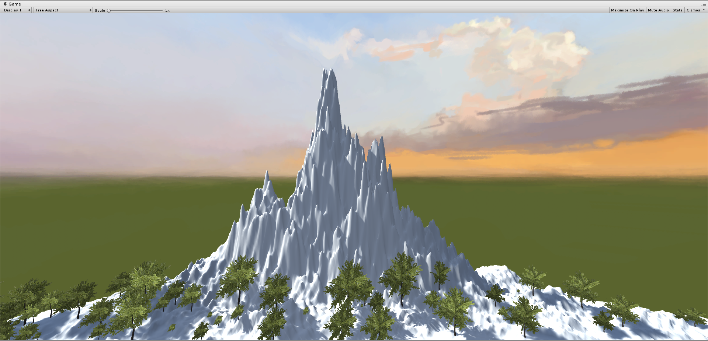
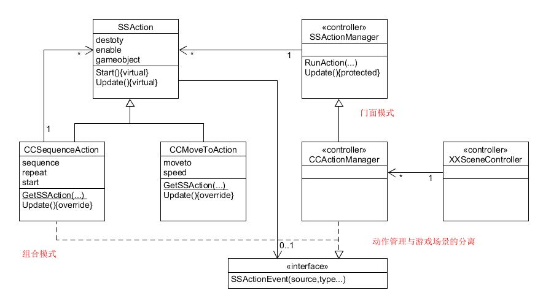
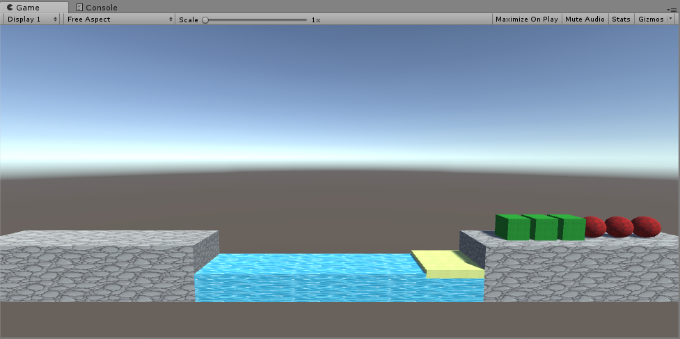

# Homework 3

> Unity3d-Learning      
>
> 游戏对象与图形基础
>
> [博客](https://blog.csdn.net/MRMRWWW/article/details/79810536)

## 1、操作与总结

1.参考 Fantasy Skybox FREE 构建自己的游戏场景

> **项目位于在./Sky目录下**
>
> **效果图：**
>
> 
>

2.写一个简单的总结，总结游戏对象的使用

> 游戏中的所有对象本质上都是游戏对象，游戏对象是其他组件的容器，游戏对象可以通过添加各种组件（如代码、材料、效果、特效等）而实现各种功能。
>

## 2、编程实践

### 牧师与魔鬼 动作分离版

* **项目文件位于PriestsAndDevils目录下**

* 规划与设计

  > 

* 效果图

  > 

* [演示视频](PriestsAndDevilsMovie.mp4)

