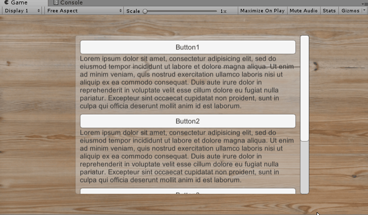
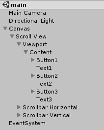

# Homework 8

> Unity3d-Learning
>
> UI系统

## UI效果制作（Quest Log公告牌）

参考这个网站制作：http://www.tasharen.com/ngui/example9.html

**制作效果：**



**制作步骤：**

1. 按下图创建对象，其中Button的Transition要设为true

   

2. 创建以下代码，把它分别拖到3个Button中，并选择好对应的Text。

   实现方式使用了协程，参考博客：[C# IEnumerator](https://blog.csdn.net/qq_30695651/article/details/79105332)

   ```c#
   using System.Collections;
   using System.Collections.Generic;
   using UnityEngine;
   using UnityEngine.UI;
   
   public class ButtonClick : MonoBehaviour {
   
       public Text text;
       private int frame = 10;
       private bool isOpen;
   
   	// Use this for initialization
   	void Start () {
           isOpen = true;
           Button button = this.gameObject.GetComponent<Button>();
           button.onClick.AddListener(ButtonOnClick);
   	}
   	
   	// Update is called once per frame
   	void Update () {
   		
   	}
   
       void ButtonOnClick()
       {
           // 收起
           if (isOpen)
           {
               StartCoroutine(Close());
           }
           // 展开
           else
           {
               StartCoroutine(Open());
           }
       }
   
       private IEnumerator Close()
       {
           float height = 120;
           for (int i = 0; i < frame; i++)
           {
               height -= 120f / frame;
               text.rectTransform.sizeDelta = new Vector2(text.rectTransform.sizeDelta.x, height);
               if (i == frame - 1)
                   isOpen = false;
               yield return null;
           }
       }
   
       private IEnumerator Open()
       {
           float height = 0; 
           for (int i = 0; i < frame; i++)
           {
               height += 120f / frame;
               text.rectTransform.sizeDelta = new Vector2(text.rectTransform.sizeDelta.x, height);
               if (i == frame - 1)
                   isOpen = true;
               yield return null;
           }
       }
   }
   
   ```

参考博客：https://blog.csdn.net/x2_yt/article/details/71330103