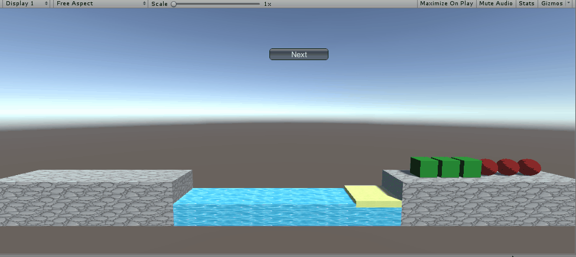

# 牧师与魔鬼 + 游戏智能提示

> Homework 9
>
> 游戏智能 PriestsAndDevils

## P&D 过河游戏智能帮助实现

### 效果GIF

看这个gif就行了，已经详细录制全过程，不再录视频



### 图数据在程序中的表示

该图一共有16个节点（状态），边有P, D, PP, DD, PD五种类型，使用了邻接矩阵的方法来存储

```c#
public enum Vertex { P3D3B, P2D2, P3D2, P3D1, P3D2B,
                        P3D1B, P3D0, P1D1, P2D2B, P0D2,
                        P0D3B, P2D1B, P0D1, P1D1B, P0D2B, P0D0}
public enum Edge { P, D, PP, DD, PD, NONE};
private Edge[,] graph = new Edge[16, 16];
private bool[] isVisited = new bool[16];
private int[] parentIndex = new int[16];    // 记录父节点的index，用于回溯找出下一步
```

### 实现状态图的自动生成

状态图及每个状态标号（将其标号方便写下面的代码）：


```c#
// 画图
public AINext()
{
    for (int i = 0; i < 16; i++)
    {
        parentIndex[i] = -1;
        isVisited[i] = false;
        for (int j = 0; j < 16; j++)
        {
            graph[i, j] = Edge.NONE;
        }
    }

    graph[0, 1] = Edge.PD;
    graph[0, 2] = Edge.D;
    graph[0, 3] = Edge.DD;

    graph[1, 0] = Edge.PD;
    graph[1, 4] = Edge.P;

    graph[2, 0] = Edge.D;

    graph[3, 0] = Edge.DD;
    graph[3, 4] = Edge.D;

    graph[4, 1] = Edge.P;
    graph[4, 3] = Edge.D;
    graph[4, 6] = Edge.DD;

    graph[5, 6] = Edge.D;
    graph[5, 7] = Edge.PP;

    graph[6, 4] = Edge.DD;
    graph[6, 5] = Edge.D;

    graph[7, 8] = Edge.PD;
    graph[7, 5] = Edge.PP;

    graph[8, 7] = Edge.PD;
    graph[8, 9] = Edge.PP;

    graph[9, 8] = Edge.PP;
    graph[9, 10] = Edge.D;

    graph[10, 9] = Edge.D;
    graph[10, 12] = Edge.DD;

    graph[11, 12] = Edge.PP;

    graph[12, 10] = Edge.DD;
    graph[12, 11] = Edge.PP;
    graph[12, 13] = Edge.P;
    graph[12, 14] = Edge.D;

    graph[13, 12] = Edge.P;
    graph[13, 15] = Edge.PD;

    graph[14, 12] = Edge.D;
    graph[14, 15] = Edge.DD;

    graph[15, 14] = Edge.DD;
    graph[15, 13] = Edge.PD;
}
```

### 利用算法实现下一步的计算

使用的算法为BFS算法

```c#
// 用BFS算法求出下一步
public Edge GetNext(Vertex curVertex)
{
    if (curVertex == Vertex.P0D0)
        return Edge.NONE;  
    for (int i = 0; i < 16; i++)
    {
        parentIndex[i] = -1;
        isVisited[i] = false;
    }
    Queue<Vertex> queue = new Queue<Vertex>();
    isVisited[(int)curVertex] = true;
    queue.Enqueue(curVertex);
    while (queue.Count != 0)
    {
        Vertex temp = queue.Dequeue();     
        if (temp == Vertex.P0D0)
            break;     // 到达终点
        for (int i = 0; i < 16; i++)
        {
            if (!isVisited[i] && graph[(int)temp, i] != Edge.NONE)
            {
                isVisited[i] = true;
                parentIndex[i] = (int)temp;     // 记录父节点的index
                queue.Enqueue((Vertex)i);
            }
        }
    }

    ArrayList list = new ArrayList();
    int index = 15;   
    while (true)
    {      
        if (index == -1)
            break;
        list.Add(index);
        index = parentIndex[index];
    }

    Edge nextEdge = Edge.NONE;
    Vertex nextVertex = (Vertex)list[list.Count - 2];
    nextEdge = graph[(int)curVertex, (int)nextVertex];

    return nextEdge;
}
```

### FirstController部分

```c#
/********************************** AI NEXT ********************************************/
// 获取当前状态
private AINext.Vertex GetCurState()
{
    if (boat.Get_to_or_from() == 1 && FromPriestsCount() == 3 && FromDevilsCount() == 3)
    {
        return AINext.Vertex.P3D3B;     // 0
    }
    else if (boat.Get_to_or_from() == -1 && FromPriestsCount() == 2 && FromDevilsCount() == 2)
    {
        return AINext.Vertex.P2D2;      // 1
    }
    else if (boat.Get_to_or_from() == -1 && FromPriestsCount() == 3 && FromDevilsCount() == 2)
    {
        return AINext.Vertex.P3D2;      // 2
    }
    else if (boat.Get_to_or_from() == -1 && FromPriestsCount() == 3 && FromDevilsCount() == 1)
    {
        return AINext.Vertex.P3D1;      // 3
    }
    else if (boat.Get_to_or_from() == 1 && FromPriestsCount() == 3 && FromDevilsCount() == 2)
    {
        return AINext.Vertex.P3D2B;     // 4
    }
    else if (boat.Get_to_or_from() == 1 && FromPriestsCount() == 3 && FromDevilsCount() == 1)
    {
        return AINext.Vertex.P3D1B;     // 5
    }
    else if (boat.Get_to_or_from() == -1 && FromPriestsCount() == 3 && FromDevilsCount() == 0)
    {
        return AINext.Vertex.P3D0;      // 6
    }
    else if (boat.Get_to_or_from() == -1 && FromPriestsCount() == 1 && FromDevilsCount() == 1)
    {
        return AINext.Vertex.P1D1;      // 7
    }
    else if (boat.Get_to_or_from() == 1 && FromPriestsCount() == 2 && FromDevilsCount() == 2)
    {
        return AINext.Vertex.P2D2B;     // 8
    }
    else if (boat.Get_to_or_from() == -1 && FromPriestsCount() == 0 && FromDevilsCount() == 2)
    {
        return AINext.Vertex.P0D2;      // 9
    }
    else if (boat.Get_to_or_from() == 1 && FromPriestsCount() == 0 && FromDevilsCount() == 3)
    {
        return AINext.Vertex.P0D3B;     // 10
    }
    else if (boat.Get_to_or_from() == 1 && FromPriestsCount() == 2 && FromDevilsCount() == 1)
    {
        return AINext.Vertex.P2D1B;     // 11
    }
    else if (boat.Get_to_or_from() == -1 && FromPriestsCount() == 0 && FromDevilsCount() == 1)
    {
        return AINext.Vertex.P0D1;      // 12
    }
    else if (boat.Get_to_or_from() == 1 && FromPriestsCount() == 1 && FromDevilsCount() == 1)
    {
        return AINext.Vertex.P1D1B;     // 13
    }
    else if (boat.Get_to_or_from() == 1 && FromPriestsCount() == 0 && FromDevilsCount() == 2)
    {
        return AINext.Vertex.P0D2B;     // 14
    }    
    return AINext.Vertex.P0D0;
}

// 上船。type为0牧师上船；type为1恶魔上船
public void GetOnBoat(int type)
{
    if (boat.toOrFrom == 1)
    {
        for (int i = 0; i < fromCoast.passengerPlaner.Length; i++)
        {
            if (fromCoast.passengerPlaner[i] != null && fromCoast.passengerPlaner[i].MyGetType() == type)
            {
                CharacterIsClicked(fromCoast.passengerPlaner[i], fromCoast.passengerPlaner[i].character);
                break;
            }
        }
    }
    else
    {
        for (int i = 0; i < toCoast.passengerPlaner.Length; i++)
        {
            if (toCoast.passengerPlaner[i] != null && toCoast.passengerPlaner[i].MyGetType() == type)
            {
                CharacterIsClicked(toCoast.passengerPlaner[i], toCoast.passengerPlaner[i].character);
                break;
            }
        }
    }
}

// 下船
public void GetOffBoat()
{
    if (boat.passenger[0] != null)
        CharacterIsClicked(boat.passenger[0], boat.passenger[0].character);
    if (boat.passenger[1] != null)
        CharacterIsClicked(boat.passenger[1], boat.passenger[1].character);
}

public void InvokeMoveBoat()
{
    MoveBoat(boat.boat);
}
    
AINext mynext = new AINext();

// 下一步
public void NextStep()
{
    if (userUI.status == 1 || userUI.status == 2)
        return;
    GetOffBoat();
    AINext.Edge next = mynext.GetNext(GetCurState());
    if (next == AINext.Edge.D)
        GetOnBoat(1);
    else if (next == AINext.Edge.DD)
    {
        GetOnBoat(1);
        GetOnBoat(1);
    }
    else if (next == AINext.Edge.P)
    {
        GetOnBoat(0);
    }
    else if (next == AINext.Edge.PD)
    {
        GetOnBoat(0);
        GetOnBoat(1);
    }
    else if (next == AINext.Edge.PP)
    {
        GetOnBoat(0);
        GetOnBoat(0);
    }
    Invoke("InvokeMoveBoat", 0.1f);
    Invoke("GetOffBoat", 0.1f);
}
```

### IUserAcation接口

```c#
public interface IUserAction {
    void MoveBoat(GameObject clickedObject);
    void CharacterIsClicked(ICharacterController characterController, GameObject clickedObject);
    void ReStart();

    void GetOnBoat(int type);
    void GetOffBoat();
    void InvokeMoveBoat();

    // AI
    void NextStep();
}
```

### 在UserUI里增加一个Next按钮

```c#
if (GUI.Button(new Rect(Screen.width / 2 - 30, Screen.height / 2 - 140, 100, 20), "Next"))
{
    action.NextStep();
}
```

参考：[P&D 过河游戏智能帮助实现](https://blog.csdn.net/kiloveyousmile/article/details/71727667)