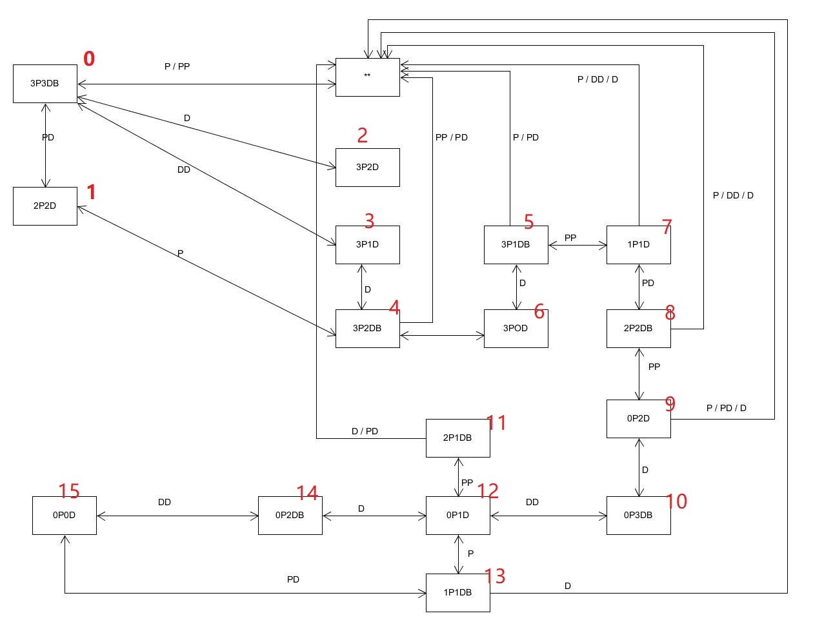

# 牧师与魔鬼 + 游戏智能提示

> Homework 9
>
> 游戏智能 PriestsAndDevils

## P&D 过河游戏智能帮助实现

### 实现状态图的自动生成

状态图及其标号：

### 图数据在程序中的表示

### 利用算法实现下一步的计算

参考：[P&D 过河游戏智能帮助实现](https://blog.csdn.net/kiloveyousmile/article/details/71727667)