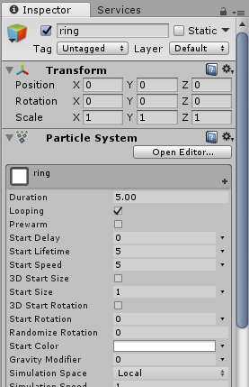
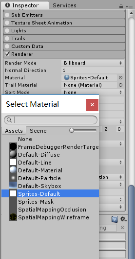
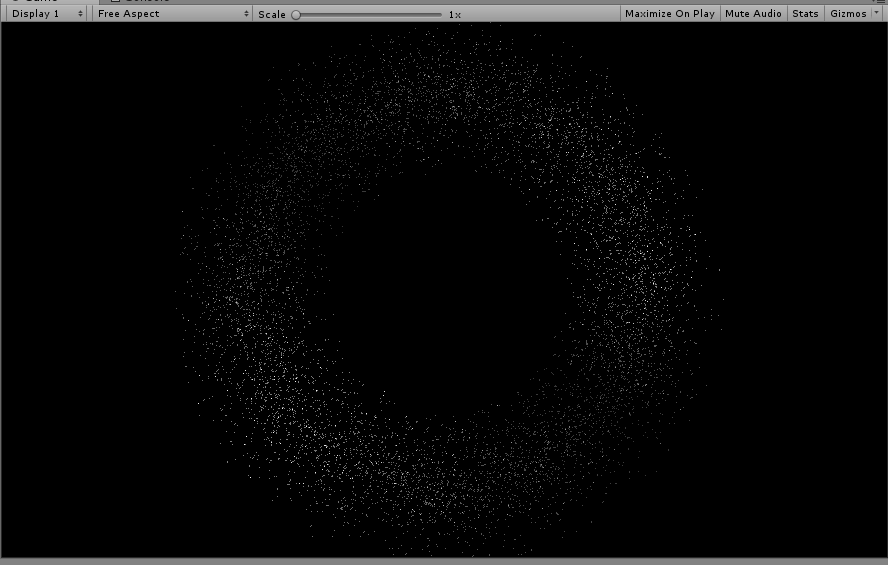

# Homework 7

> Unity3d-Learning
>
> 粒子系统

## 制作粒子光环

1. 创建空对象ring，为ring添加组件Particle System

   

   

2. 在Particle System里的Renderer更换材质

   

3. 新建代码ParticleRing.cs

4. 将ParticleRing.cs拖到空对象ring上就可以了

**制作效果：**

参考博客：https://blog.csdn.net/simba_scorpio/article/details/51251126